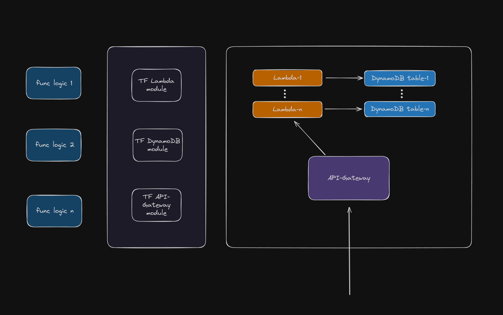

# Terrafrom modules for creating lambda functions



Check modules docs:
 - [Lambda](./aws-infra/modules/lambda/README.md)
 - [DynamoDB](./aws-infra/modules/dynamoDB/README.md)

```tf
module "lambda" {
  source = "./modules/lambda"

  lambda_config = {
    "function1" = {
      work_dir          = "../lambda/"
      bin_name          = "bootstrap"
      archive_bin_name  = "function.zip"
      function_name     = "test-function-1"
      handler           = "main"
      runtime           = "provided.al2023"
      ephemeral_storage = "512"
      archive_type      = "zip"
      command           = "GOOS=linux GOARCH=amd64 go build -o bootstrap"
      interpreter       = ["/bin/bash", "-c"]
      # tag_name             = "func1"
      # tag_description      = "createuser"
      # tag_function_version = "$LATEST"
    }
    "function2" = {
      work_dir             = "../lambda/"
      bin_name             = "bootstrap"
      archive_bin_name     = "function.zip"
      function_name        = "test-function-2"
      handler              = "main"
      runtime              = "provided.al2023"
      ephemeral_storage    = "512"
      archive_type         = "zip"
      command              = "GOOS=linux GOARCH=amd64 go build -o bootstrap"
      interpreter          = ["/bin/bash", "-c"]
      tag_name             = "func2"
      tag_description      = "deleteuser"
      tag_function_version = "$LATEST"
    }
  }
}

module "dynamodb" {
  source = "./modules/dynamoDB"

  dynamodb = {
    table1 = {
      name           = "userTable"
      billing_mode   = "PROVISIONED"
      read_capacity  = 5
      write_capacity = 5
      hash_key       = "username"
      attribute = [
        {
          name = "username"
          type = "S"
        },
      ]
      tag_name        = "userTable"
      tag_environment = "Dev"
    },
  }
}
```
